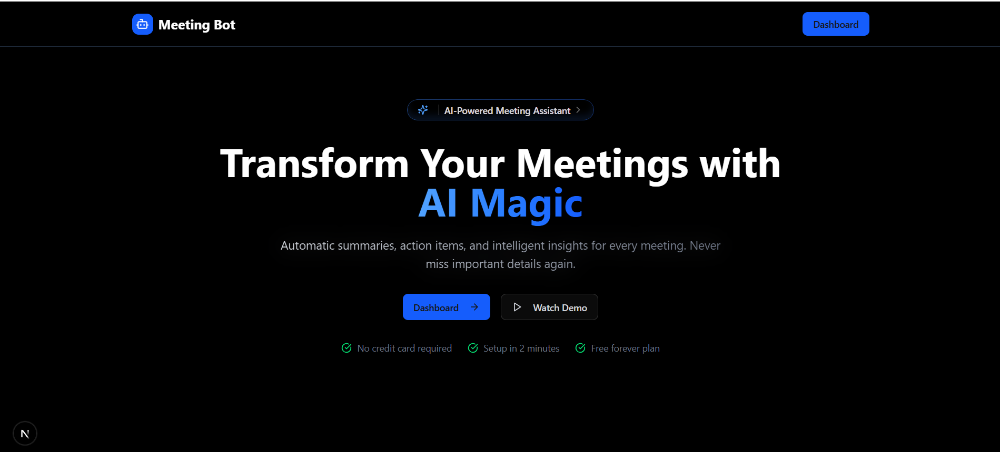
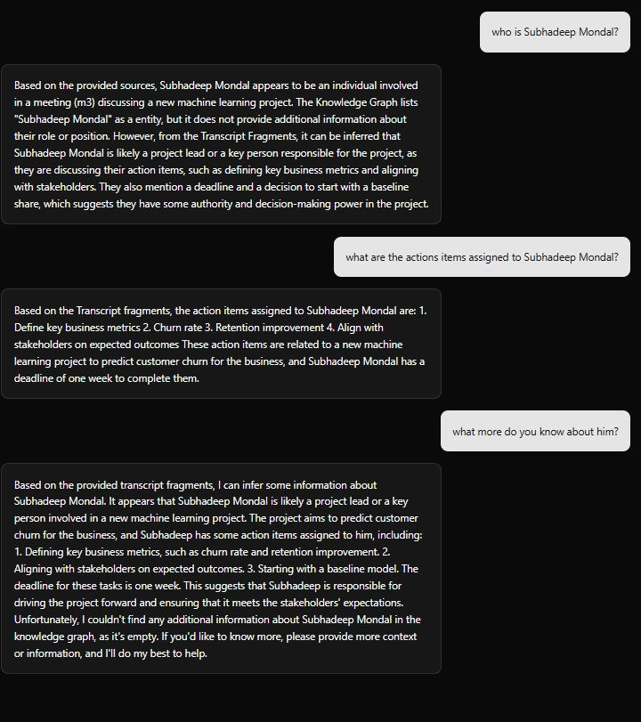
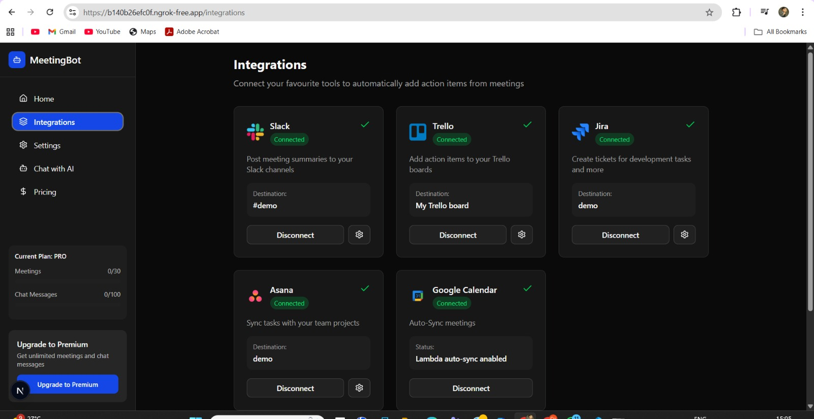
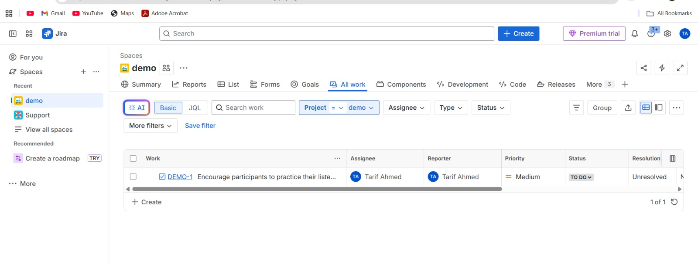
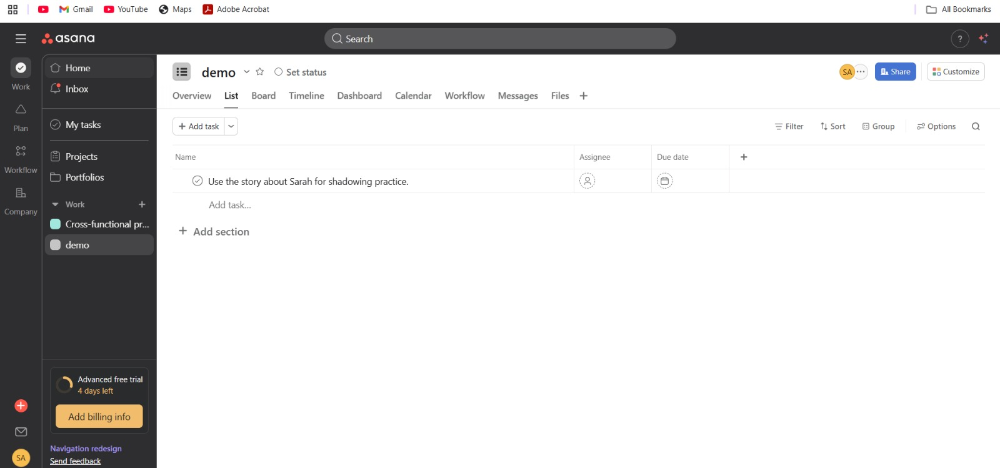
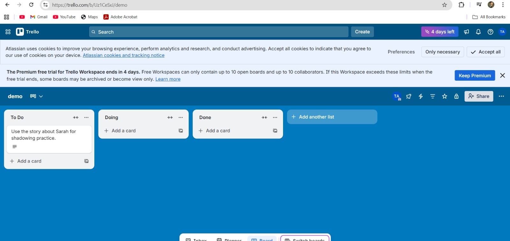

# Memoir-Ai
### The Open-Source Enterprise Meeting Intelligence Platform



[](https://opensource.org/licenses/MIT)
[](https://nextjs.org/)
[](https://www.typescriptlang.org/)
[](https://aws.amazon.com/)
[]()

## 📖 Executive Summary

**Memoir-Ai** is an autonomous meeting intelligence platform designed to democratize access to conversational analytics. While commercial solutions like Fireflies.ai or Otter.ai exist, they operate as "black box" SaaS products with rigid pricing and data privacy concerns. Memoir-Ai provides a transparent, open-source alternative that integrates seamlessly into existing enterprise ecosystems (Zoom, Teams, Google Meet, Slack, Jira).

> [!IMPORTANT]
> **Academic Foundation:** This project is backed by deep research into Cognitive Intelligence and Hybrid RAG. 
> **[📄 Read the Full Research Paper](./docs/AI_Based_Meeting_Bot_A_Cognitive_Intelligence_Solution_using_Sentiment_Analysis_&_Hybrid_RAG_Strategy_final.pdf)**

---

## 📸 Product Interface & Insights

| **Knowledge Graph** | **Risk Analysis & Blindspots** |
| :---: | :---: |
|  |  |
| *Visualizing entity relationships and decision nodes extracted from transcripts.* | *AI-generated risk assessment based on critical transcript analysis.* |

| **Sentiment & Emotional Arc** | **Global RAG Chat** |
| :---: | :---: |
|  |  |
| *Real-time sentiment tracking per speaker to gauge meeting health.* | *Query your entire meeting history using Semantic Search.* |

### **Automated Task Integration**

| **JIRA** | **ASANA** | **TRELLO** |
| :---: | :---: | :---: |
|  |
|  |  |  |
| *Sync tasks directly to Jira backlogs from meeting transcripts.* | *Automate workspace task creation via Asana integration.* | *Push action items to Trello boards with assigned owners.* |

---

## 🎯 Vision & Problem Statement

### The Problem
Professionals spend approximately **30-50% of their time in meetings**, yet 90% of the data generated is lost. Existing tools are fragmented, passive, and cost-prohibitive for large teams.

### The Solution
Memoir-Ai acts as an active participant. It uses a **Split-Brain Architecture** (Next.js Frontend + AWS Lambda Scheduler) to record, transcribe, and push data to where work actually happens.

---

## 🏗 System Architecture

Memoir-Ai utilizes a modern, event-driven architecture designed for high availability and low latency.


### 1. The Autonomous Scheduler (AWS Lambda)
* **Event Source:** Google Calendar Webhooks trigger synchronization events.
* **Execution:** AWS EventBridge schedules ephemeral **AWS Lambda** functions to join meetings.
* **Efficiency:** Zero idle server costs.

### 2. The Intelligence Engine (Hybrid RAG Pipeline)
* **Vector DB:** Vectors are stored in **Pinecone** with metadata filtering.
* **Graph DB:** Complex entity relationships are mapped to visualize meeting context.
* **Retrieval:** Uses a Retrieval-Augmented Generation (RAG) pipeline to answer complex business queries.

---

## 📊 Competitive Analysis

| Feature Comparison | Memoir-Ai (Open Source) | Commercial SaaS (Fireflies/Otter) |
| :--- | :--- | :--- |
| **Data Sovereignty** | **100% Self-Hosted** | Vendor Locked |
| **Meeting History Query** | **Global RAG** | Limited Context |
| **Integration Ecosystem** | **Full Write-Access** | Read-Only/Premium |
| **Cost Efficiency** | **Pay-per-use (API)** | Flat Monthly ($20+/user) |

---

## 🚀 Key Features

* **Universal Bot Deployment:** Joins Zoom, Meet, and Teams calls autonomously.
* **Speaker Diarization:** Advanced audio processing to distinguish speakers.
* **Smart Summaries:** Generates executive summaries and Action Items.
* **Project Management Push:** One-click ticket creation in **Jira**, **Asana**, and **Trello**.
* **Slack Integration:** Query meeting insights directly via Slack bot.

---

## 🛠 Technology Stack

* **Frontend:** Next.js 15, TypeScript, Tailwind CSS 4, Shadcn UI
* **Backend:** AWS Lambda, S3, EventBridge, NeonDB (PostgreSQL), Prisma
* **AI/ML:** OpenAI GPT-4o, Pinecone (Vector Search), MeetingBaas API
* **Infrastructure:** Clerk (Auth), Stripe (Payments), Resend (Email)

---

## 💻 Installation & Deployment

### 1. Local Development Setup

```bash
# Clone the repository
git clone [https://github.com/TARIFUDDIN/Memoir-Ai.git](https://github.com/TARIFUDDIN/Memoir-Ai.git)
cd memoir-ai

# Install dependencies
npm install

# Initialize Database Schema
npx prisma generate
npx prisma db push

# Start server
npm run dev